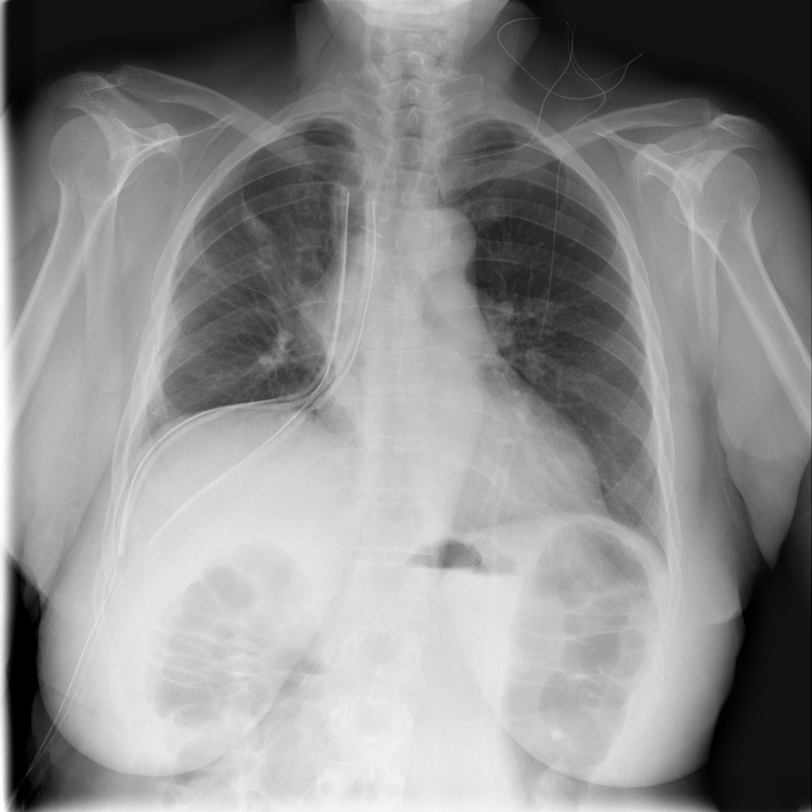
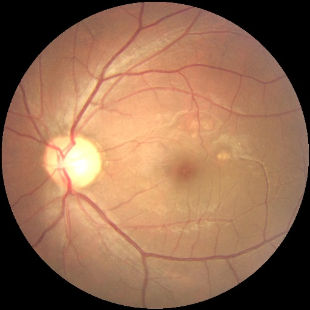
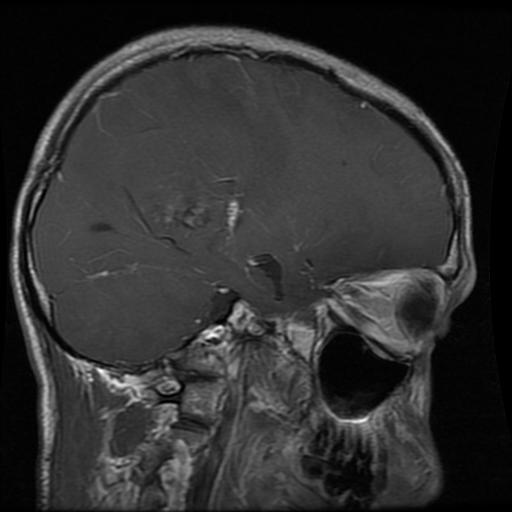

# Imprecise-Label Learning Datasets of medical imaging (ILLMed) 

This repository publishes **multi-expert annotations** as standardized label tables (CSV/Parquet/Mat) in the *SEU PLL dataset format* for "difficult" samples in three public medical image datasets. The disagreements on many samples present unique challenges to medical image classification tasks.

Important:
- **No dataset images are included in this repository.** Full image sets are hosted on Kaggle (this repo only includes a few small example images for illustration in the README).
- **No train/val/test split is provided.** All exports keep the full dataset; users can split as needed.

## Raw images

| Dataset | Kaggle source | #Images labeled | #Images in total | #Classes (Q) |
|---|---|---:|---:|---:|
| dataset14 (dif-nih14) | https://www.kaggle.com/datasets/yufaja/dif-nih14 | 4683 | 11212 | 14 |
| dataset15 (dif-orid5k-balanced) | https://www.kaggle.com/datasets/yufaja/dif-orid5k-balanced | 2765 | 2765 | 8 |
| dataset16 (dif-mritumor) | https://www.kaggle.com/datasets/yufaja/dif-mritumor | 1431 | 1431 | 4 |

Note: dataset14 is **partially annotated** at the moment; the exported tables include labeled images only.

## Quickstart (for users)
You do **NOT** need `~/ml4img/f4dficimg/...` to use these datasets.

1) Download images from Kaggle and extract. The extracted folder (e.g., `dif-nih14/`) contains **all images directly under it** (no split).

2) Use the label tables in this repository (e.g., `dataset14/csv_data/pll_dataset.csv`).

3) Build local image paths using the **filename** field `image_path`:

```python
from pathlib import Path
import pandas as pd

IMAGE_ROOT = Path("/path/to/dif-nih14")
pll = pd.read_csv("dataset14/csv_data/pll_dataset.csv")
pll["full_path"] = pll["image_path"].apply(lambda p: IMAGE_ROOT / p)

# partial_target: JSON list of candidate label_id; target: a single label_id
print(pll[["image_id", "full_path", "partial_target", "target"]].head())
```

See `dataset*/code/data_loader.py` for full loaders.

## Example: real multi-expert disagreement (from XLSX snapshots)
This repo does not ship full dataset image sets (they are on Kaggle), but it includes a few small example images below for illustration.

Below are **real** cases where multiple experts disagreed. Expert IDs are anonymized.

Example images (copied from maintainer local trace folders for illustration):

### dataset14 (dif-nih14)


- `image_name`: `00000416_004.png`

- Experts (anonymized):
  - Expert A → candidates `[90, 91]` (`Cardiomegaly` / `Nodular Mass`)
  - Expert B → `[89]` (`Pleural thickening`)
- Exported fields:
  - `target`: `Pleural thickening` (label_id=89)
  - `partial_target`: {`Pleural thickening` (89), `Cardiomegaly` (90), `Nodular Mass` (91)}

### dataset15 (dif-orid5k-balanced)


- `image_name`: `7_left.jpg`

- Experts (anonymized):
  - Expert A → `Other Disease/Abnormality` (其他疾病/异常)
  - Expert B → `Normal` (正常)
  - Expert C → `Age-related Macular Degeneration` (年龄相关性黄斑变性)
- Exported fields:
  - `target`: `Age-related Macular Degeneration` (label_id=98)
  - `partial_target`: {`Normal` (94), `Age-related Macular Degeneration` (98), `Other Disease/Abnormality` (101)}

### dataset16 (dif-mritumor)


- `image_name`: `gl-0045.jpg`

- Experts (anonymized):
  - Expert A → `Pituitary tumor` (垂体瘤)
  - Expert B → `Glioma` (胶质瘤)
  - Expert C → `No tumor` (无肿瘤)
- Exported fields:
  - `target`: `No tumor` (label_id=105)
  - `partial_target`: {`Glioma` (102), `Pituitary tumor` (104), `No tumor` (105)}

## Upstream pipeline (how these datasets were produced)
1) Difficult-sample pre-selection: `ml4img` (ResNet + K-fold + uncertainty/disagreement)
   - https://github.com/yufao/ML4md-img-cls
   - key scripts: `aggregate_difficult_multilabel.py`, `extract_difficult_images.py`

2) Expert annotation: `medc-img-annotation-app` (frontend/backend)
   - https://github.com/yufao/medc-img-annotation-app
   - experts label images and export XLSX snapshots (images/annotations/labels/info)

3) Standardization & publishing: this repo converts XLSX → SEU PLL tables.

## UUID prefix rule (traceability)
The annotation system stores image paths as:

`static/img/<uuid32>_<original_filename>`

In exports, we strip the `<uuid32>_` prefix and keep `image_path=<original_filename>`.

## Repository structure
- `core_mappings/`
  - `dataset_mapping.csv`: dataset_id ↔ subdir ↔ number of classes
  - `image_id_mapping.csv`: image_id ↔ uuid32 ↔ original filename ↔ trace path
  - `label_dict.csv`: label_id ↔ label_name (grouped by dataset_id)
- `dataset14/`, `dataset15/`, `dataset16/`
  - `csv_data/pll_dataset.csv`: main table
  - `csv_data/partial_target.parquet`: $Q\times M$ candidate matrix (0/1), index=label_id, columns=image_id
  - `csv_data/target.parquet`: $1\times M$ target vector, columns=image_id
  - `mat_data/pll_dataset.mat`: Matlab-friendly export (no trainIndex/testIndex)
  - `id_mapping.csv`: per-dataset trace mapping
  - `data_stats.md`: auto stats report
  - `code/`: `data_loader.py`, `stats_visualization.py`
- `batch_processor.py`: export + consistency validation
- `audit_selfcheck.py`: self-audit checklist → `audit_report.md` + `audit_logs/`

## Data links
See `data_links.md` for Kaggle links and path mapping.

## Maintainers: export & validation (NOT required for users)
Export (re-generate tables from XLSX snapshots):

```bash
python batch_processor.py --export
```

Override XLSX paths:

```bash
python batch_processor.py --export \
  --xlsx14 /path/to/ds14.xlsx \
  --xlsx15 /path/to/ds15.xlsx \
  --xlsx16 /path/to/ds16.xlsx
```

Incremental update (only one dataset):

```bash
python batch_processor.py --export --only-datasets 14 --xlsx14 /path/to/ds14.xlsx
python batch_processor.py --validate-only --only-datasets 14
```

Note: current maintainer validation enforces **100% local traceability** to `~/ml4img/f4dficimg/<subdir>/...`.

Self-audit report:

```bash
python audit_selfcheck.py
```

## License
- Code & docs: see `LICENSE` (Apache-2.0)
- Images & upstream datasets: follow the original dataset licenses/terms. This repo distributes labels/tables only.
- See `LICENSE_DATASETS.md` for per-dataset notes.

---

## 中文简版
- 图片在 Kaggle，本仓库只提供标签表（CSV/Parquet/Mat），不提供 train/test 划分。
- 普通使用者：下载 Kaggle 图片解压后，用 `full_path = IMAGE_ROOT / image_path` 读取图像。
- 维护者：从标注系统 XLSX 重新导出与审计，支持 `--only-datasets` 增量更新。
